

*The source code (R Markdown) for this document is available for modification and re-use under a CC-BY-SA license at <https://github.com/dalejbarr/moodle-assignments>.*

- [Dale Barr](https://twitter.com/dalejbarr/) and [Helena Paterson](https://twitter.com/PatersonHelena)

This document will take you step-by-step through the process of setting up a timed assignment or exam using Moodle **Assignments**. It is assumed that you already have set up a Moodle page for your course, and added a section into which you will place the assignment. What this document does *not* cover is how to have different versions of an exam for different students/groups; although this is possible, for simplicity, this document assumes that all students receive the same version of the exam. The following topics are covered:

1. Adding and configuring a new assignment.
2. Downloading completed assignments and the marking sheet.
3. Marking the assignments and uploading grades and feedback.

## Adding and configuring a new assignment {#editon}

On your Moodle course page, click on the cog symbol in the top right and then from the pull-down menu, choose "Turn editing on".

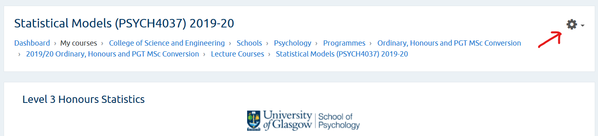

You will see your course page divided up into sections. Scroll down to the relevant section and find the link named **"+ Add an activity or resource"** at the bottom of that section. Once you click this link, a pop-up dialog will appear allowing you to choose the activity type. Select Assignment and then click the Add button.

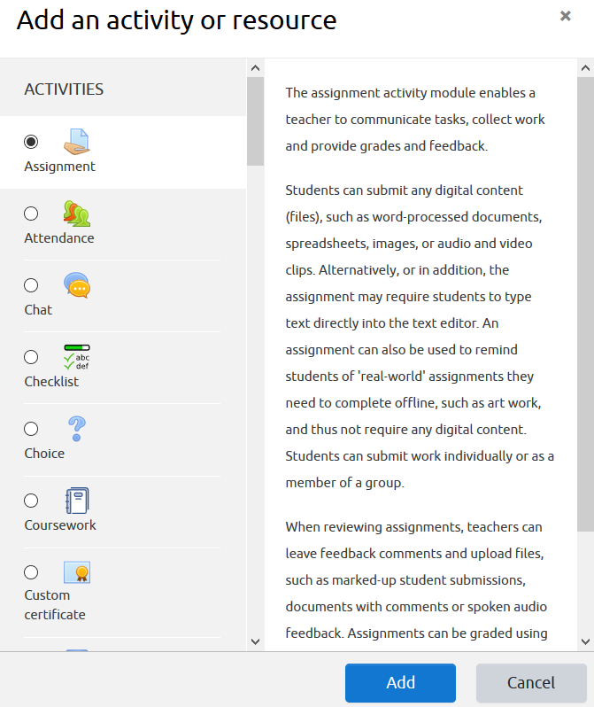

You'll now be led to a page that asks for lots of information about the assignment. There are an overwhelming number of submenus and options here. For help with each option, click your mouse pointer on the little blue question mark next to the option. There are far too many to cover in detail here, but these are the main things to pay attention to:

* **Name**: The name of the Assignment as it will appear to student; e.g., "Final Exam";
* **Description**: A short description of the assignment for students. You can put instructions here.
* **Additional Files**: Any files you need students to download to complete the assignment. These will appear below the description.
* **Availability**: This section allows you to set the date/time when submission will become available, the deadline for uploading the completed assignment, and the cut-off: the date/time beyond which it will no longer be possible for students to submit.
* **Submission Types**: Set the file types and maximum number of files allowed.
* **Feedback Types**: Set the type of feedback you will provide.
* **Grade**: Determine what grading scale you will use.

**NB:** It is probably a bad idea to list the due date or duration of the assignment in the *Description* field, as deadlines/exam durations can differ for different students, depending on disability requirements. Moodle will automatically display this information to students anyway. 

### Availability

In the **Availability** section, you will probably want to enable the "Allow submissions from" and "Due date" options. You do this by ensuring the boxes next to these items are checked. Let's say you have an exam starting on April 1, 2020 from 2pm--4pm. You'd fill out this section as shown below.

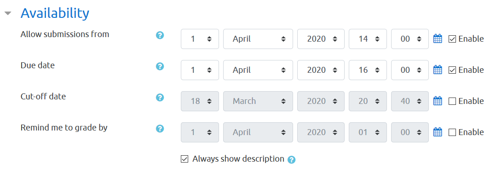

Under this setting, students will be able to see the assignment, description, and any additional files as soon as you save the assignment, as long as it is not hidden (see below). However, they can only submit files from the "Allow Submissions From" date, e.g., from 2pm on April 1, 2020. If desired, you can also make the description of the assignment invisible to students until the "Allow Submissions From" date by unchecking "Always show description."

Any submissions that occur after the due date will be marked as late, although students will still be allowed to submit until the cut-off date/time. If you disable the cut-off, then students can submit indefinitely, but those submissions received after the due date will still be marked as late.

If you don't care about submissions being marked as late, and just want to leave it wide open, you should disable both the Due Date and Cut Off options (leave 'Enable' unchecked next to each option).

The due dates/cutoffs that you set here are for the entire class. If you have to configure extra time for certain students, after you have saved the assignment you can use [user overrides](#overrides) as described later in this document.

### Submission Types

Choose the type of submission and number of files allowed. If there is just one file for students to submit, this section should look like this:

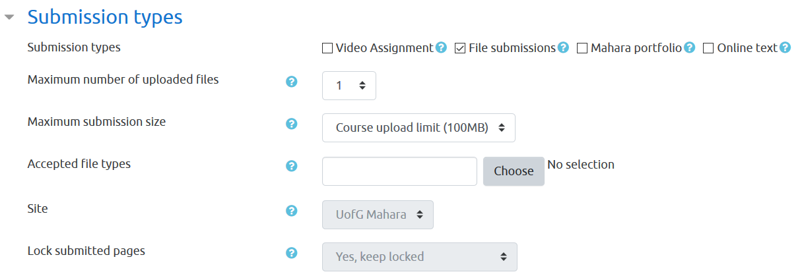

If you want to only allow a particular type of file (e.g., word processing documents) then click Choose and select the file type from the pop-up dialog.

### Feedback Types

Here you establish the kind of feedback you will provide. The most common options is "Feedback files", but read the help next to each option (click on the blue question mark) and decide which are right for you. 

Enabling "Offline grading worksheet" can make the grading process more efficient, especially for large classes; otherwise, you have to enter your grades one by one.

### Grades {#grades}

It's likely that you'll want to use the University of Glasgow 22 point scale. If so, then this section should look like this.

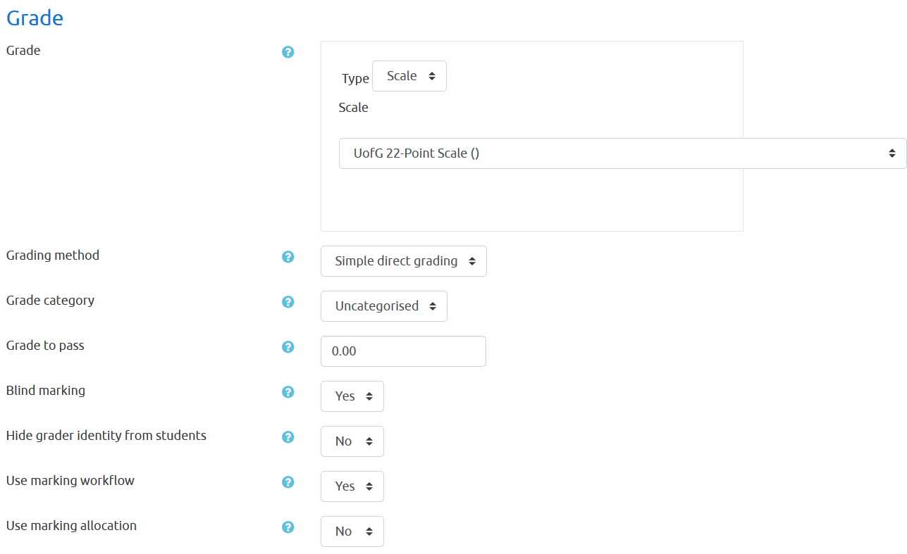

### Other useful options

* You probably don't want students to see what you're doing until you're done editing the assignment, so under **Common Module Settings** / **Availability** select "Hide From Students".

* It is also a good idea under **Common Module Settings** to set **Groups** to **Separate Groups** if you have separated students into groups for different teams of markers.

* You can use "Restrict Access" to make everything totally invisible to the class until a specified time by adding a Date restriction. This is useful if you want to place files in the Additional Files section that should only be available for download at the exam start time.

### Saving the assignment

Once you have configured the assignment to your liking, click on **Save and display**, which will take you to a screen that looks like the screen below, allowing further configuration.

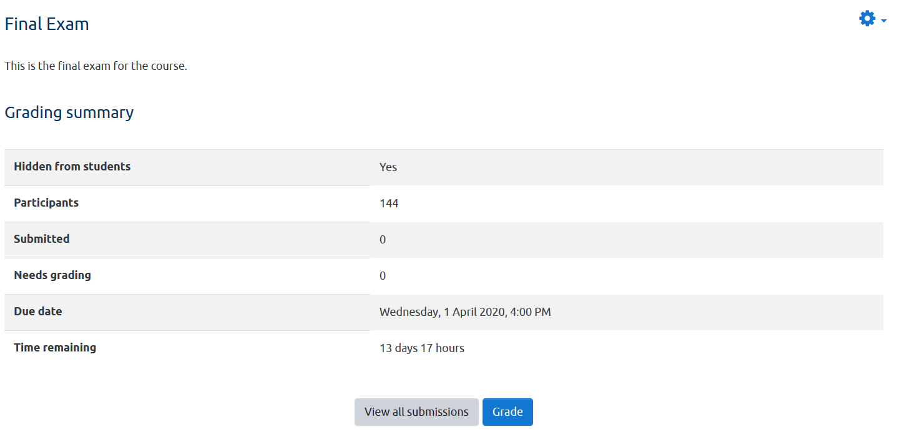

If you don't see this screen, then find the assignment you created on your course page and click on it to get there.

### Adding Extra Time for Specific Users With Overrides {#overrides}

If you have students who need to be allocated extra time, you can do this from the screen shown above by clicking the cog and selecting "User overrides." User overrides allow you to set submission deadlines at user level; group overrides allow them at group level. (If you have a big group of students who all get the same amount of extra time, it may be more efficient to create a group and then add a single override for the group than to use the user method.)

Clicking User Overrides will lead you to a screen where you'll see the button "Add user override." Click this button and you'll see a pull-down Search box where you can find a particular user. You can then modify the "Allow submissions from" or "Due date" fields for this user as needed. In the example below, I have given user Joe Public an extra 15 minutes to complete the exam; whereas the other students will see a Due Date of 16:00, Joe will see his as 16:15.

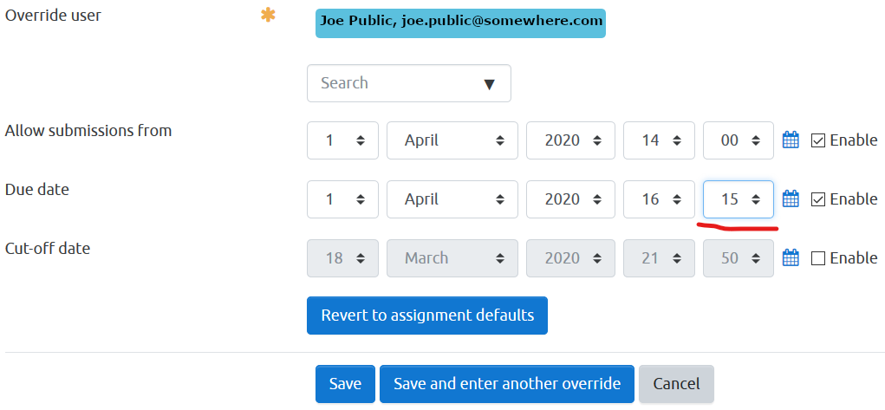

Click "Save and enter another override" to add the next one. Once you're finished you'll be sent back to a screen that shows all the overrides and allows you to edit or delete them as needed.

### Double checking the assignment

Once you're done with the above it is a good idea to take a look at the assignment you've created from the student's perspective.

To change your role to "Student", go back to the main page of your course. Look in the top right of the browser window and find your user icon. Next to it there is a down arrow that activates a drop-down menu, where you'll find "Switch role to...". This will allow you to see your page in the same way a student would see it. You switch your role back using the same drop-down menu, selecting the option "Return to my normal role...".  

If you don't see your new assignment while in the student role, it's probably because it's hidden! Return to your normal role, go into editing mode (cog in the top right), and then in the edit drop-down click Show. You can then return to the student role and see how it looks. Here's how the assignment we just set up looks to a student. (A student given an override will automatically see their own personal due date.)

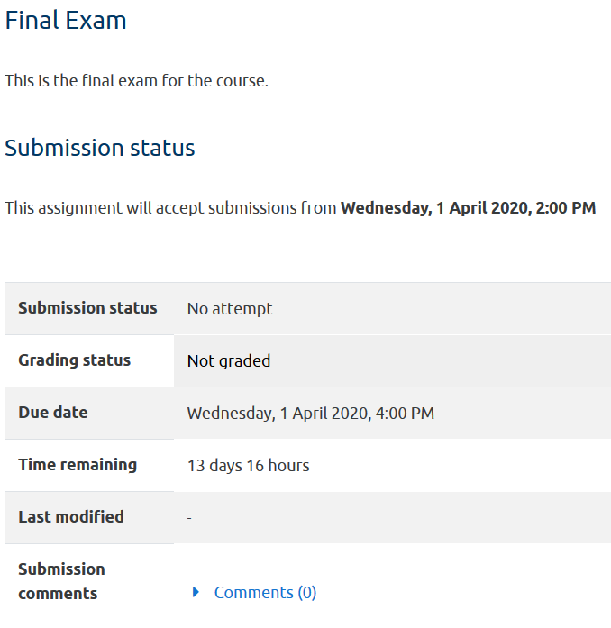

## Marking and feedback

Once the deadline has passed and students have submitted their assignments, you can either grade them one-by-one using the moodle interface (painfully slow for large classes) or download them en masse and grade them offline.

### Download for offline grading

From your course page, click on the assignment and then click "View All Submissions". Then, under "Grading action" choose "Download all submissions."

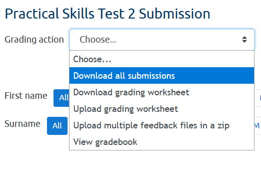

This will download a ZIP archive file. Extract all the files from the zip (right click and then Extract All... on Windows) and you will see a series of folders. If you have chosen [blind marking](#grades) as an option when setting up the assignment, then each student will have been assigned an arbitrary ID number, resulting a folder structure like the one shown below.

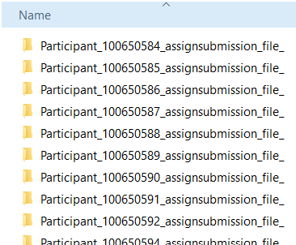

Within each folder you'll find the submission files for that student.

To download the grading worksheet, go back to the place where you selected "Grading action" to download the submissions, and from that drop-down menu select "Download grading worksheet".

This will download a CSV (Comma Separated Values) file which you can open in Excel. Type the grades into the "Grade" column, but leave the structure as it is. Assuming you're using the 22-point scale this has to be one of the values on that scale (e.g., A1, A2, ..., H).

You may find that the spreadsheet looks really wonky in Excel, like so:

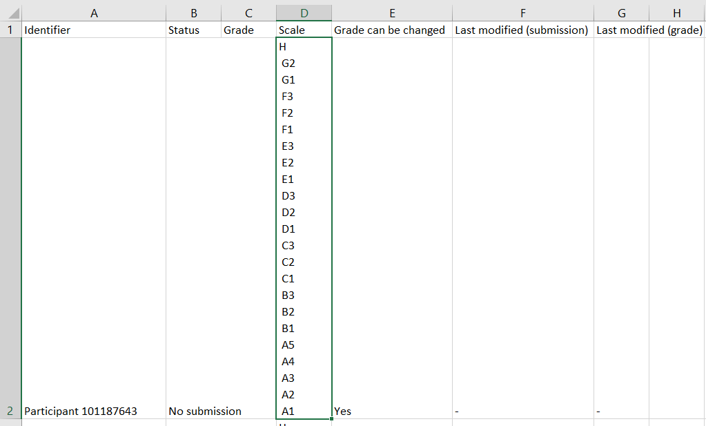

That is because the Scale column contains all 22 points in the UofG scale. You should generally not mess with the spreadsheet, but you can safely clear that column of content to make it more readable.

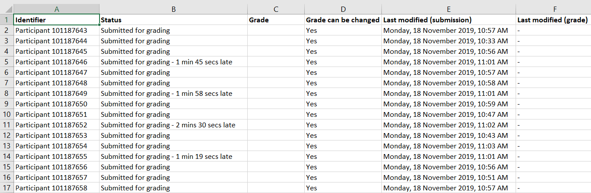

### Feedback files

You might want to provide feedback to your students. The procedure for doing this offline is as follows: Create a directory with subfolders *identically matching* the structure of the subfolder containing all the submissions; for instance, a folder named 'feedback' with this structure:

An easy way to do this is to just copy the subfolders into a the new 'feedback' folder, and then to go in and delete all of the submission files from the individual subfolders.

As you go along, add your feedback for each student into a new file (e.g., Word document) within each corresponding subfolder. 

### Uploading to Moodle

When you're done with grading and feedback, put the feedback subfolders into a ZIP archive. To do this in Windows, select all the folders within "feedback", right click somewhere on the selection, and choose *Send to > Compressed (zipped) folder*.

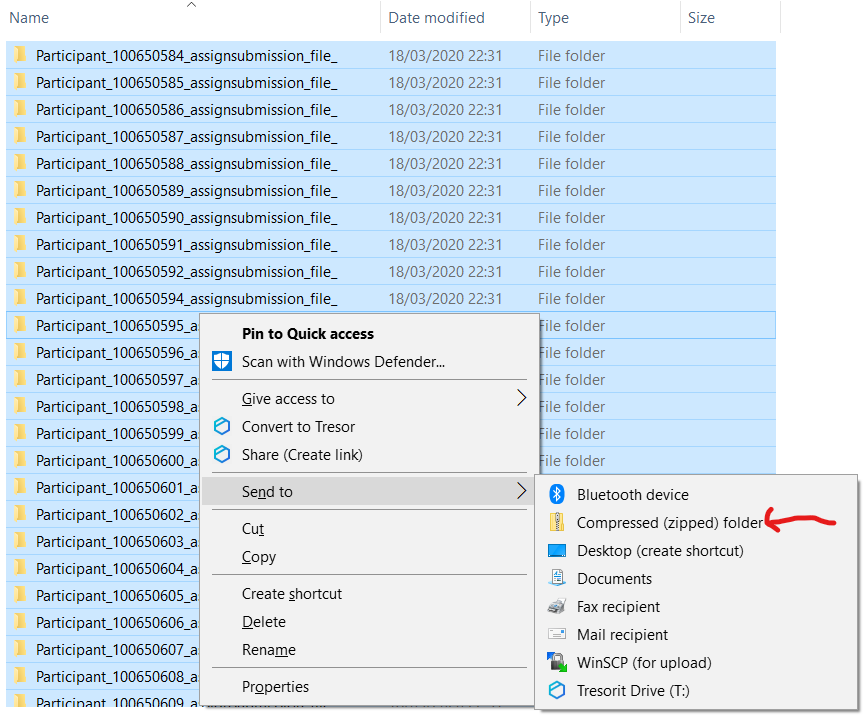

It will create a new ZIP file which will appear in the same directory, perhaps at the bottom of the screen, like so:

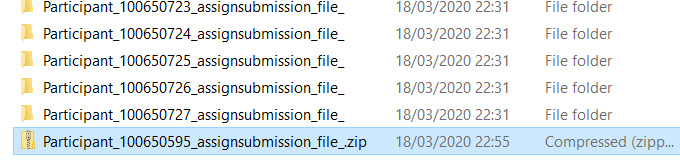

You are now ready to upload the grading worksheet and the feedback file archive to Moodle. Go back to where you first downloaded the submissions (View all submissions...) and under grading actions, you'll see the options to Upload grading worksheet and Upload multiple feedback files in a ZIP. Assuming you have formatted things correctly, uploading these files should be fairly straightforward. 

Before releasing feedback to students, check that all submitted assignments have a feedback file. You can then release the grades.

## Link Anonymous Assignment IDs to Student IDs

Sometimes with anonymous grading you need to find out the identity of a student before you release the grades. Here is a hack that allows you to do this.

On the main page for the course, click on the Settings (cog icon), select `More...`. Under **Course Administration** click the **Reports** tab, then select **Assignment submission report**. This will give you a file that links the moodle anonymous ID to student identities. 
